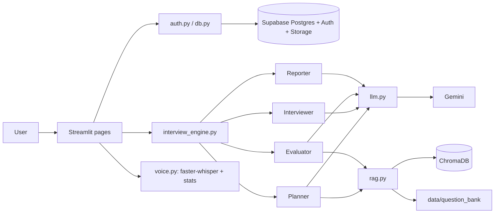

# 🧭 Pivio — Track every application, ace every interview.

## Overview and problem statement
Job seekers send many resume versions to many companies and lose track of which resume went where, then walk into interviews unprepared for *that* role. Pivio keeps a **Resume Vault** and **Application Tracker**, and runs an **AI Mock Interviewer** built from the exact resume and job description of any application.

## Features
- Email/password auth (Supabase) with row-level security; every query scoped to the user
- Resume vault: PDF upload, version labels, SHA-256 duplicate detection, optional original-file storage
- Application tracker: status badges, filters, "Resume used" column, one-click practice interview
- Interview engine with four LLM roles: Planner, Interviewer (3 personas), hidden Evaluator, Reporter
- Adaptive follow-ups driven by the evaluator's `needs_followup`; 3-10 questions with a hard turn cap
- RAG over a bundled question bank (sentence-transformers + ChromaDB)
- Voice answers (faster-whisper, disfluencies preserved) with editable transcript; text always works
- Delivery stats: filler words, words per minute, answer length
- Report with Plotly charts, best/weakest answers, improved sample answer; History page with progress chart
- Privacy notice and one-click "Delete my data"

## Architecture


## Setup
1. `python -m venv .venv && source .venv/bin/activate` (Windows: `.venv\Scripts\activate`)
2. `pip install -r requirements.txt` (install `ffmpeg` on your system too; `sudo apt install ffmpeg` or `brew install ffmpeg`)
3. **Supabase:** create a project → *SQL Editor* → paste and run `sql/schema.sql` (creates tables, indexes, RLS policies and the private `resumes` bucket) → *Authentication → Providers* → make sure **Email** is enabled (for quick testing you may turn off "Confirm email").
4. **Gemini:** create an API key in Google AI Studio.
5. `cp .env.example .env` and fill in `SUPABASE_URL`, `SUPABASE_ANON_KEY` (Project Settings → API, the *anon public* key), `GEMINI_API_KEY`. Optional: `GEMINI_MODEL`, `WHISPER_MODEL_SIZE`.

## Run
```
streamlit run app.py
```
The first interview downloads the embedding model and (for voice) the Whisper model, and builds the ChromaDB index in `.chroma/`.

## Tests
```
pip install pytest
pytest tests/
```

## Deploy on Streamlit Community Cloud
1. Push the repo to GitHub (`.env` is git-ignored).
2. Create the app on share.streamlit.io with `app.py` as the entry point; `packages.txt` installs ffmpeg automatically.
3. In *Advanced settings → Secrets*, paste:
```toml
SUPABASE_URL = "https://xxxx.supabase.co"
SUPABASE_ANON_KEY = "..."
GEMINI_API_KEY = "..."
GEMINI_MODEL = "gemini-2.0-flash"
WHISPER_MODEL_SIZE = "base"
```
4. In Supabase *Authentication → URL Configuration*, add your Streamlit app URL as a redirect URL.

## UI/Design notes
The look comes from the Stitch export "Executive Kinetic" (light SaaS, teal accent, Hanken Grotesk headings, Inter body).
- **Theme:** `.streamlit/config.toml` sets the base light theme (primary `#0D9488`, canvas `#F8FAFC`, surface `#FFFFFF`, text `#0F172A`).
- **Central CSS and tokens:** `core/ui.py`. `PALETTE` holds every colour (exposed to CSS as `--pv-*` variables and reused by Plotly); `CSS_RULES` is the only stylesheet and is injected once by `ui.setup_page()`. To restyle, edit those two and the hex values in `config.toml`; `tests/test_theme_static.py` checks they stay in sync and that no colours are hard-coded in pages.
- **Fonts:** loaded with a CSS `@import` from Google Fonts, with system fallbacks if offline.
- **Score tiers:** >= 7 teal "Strong pass", 5-6.9 amber "Needs work", < 5 red "Unprepared" (`ui.tier`). Application status badges: Applied (slate), Interview (purple), Offer (teal), Rejected (red).
- **Shared helpers:** `ui.card_head`, `ui.badge`, `ui.score_pill`, `ui.app_row`, `ui.plotly`, `ui.render_report`, `ui.flash` (toast that survives a rerun), `ui.show_error` / `ui.show_unexpected`.
- **Stable-selector caveat:** CSS targets `data-testid` attributes, which can change between Streamlit releases. If a Streamlit upgrade breaks a style, adjust the selector in `CSS_RULES`.
- **Not reproducible in Streamlit:** sidebar tagline and pinned footer (the sidebar nav is Streamlit's own; the "Pivio" brand and "Dashboard" label are CSS tricks), PDF export, "copy snippet" buttons, benchmark and percentile figures (the app has no such data).

## Known limitations
- Scanned/image-only PDFs have no extractable text (no OCR).
- `.chroma/` is ephemeral on Streamlit Cloud; the index is rebuilt automatically when empty.
- Cloud CPUs are slow for Whisper; use `tiny` or `base`. `st.audio_input` needs a browser with microphone permission.
- LLM scores are judgements, not ground truth. Results vary slightly by model and run.
- The login session lives in the browser session; a page reload requires logging in again.
- "Delete my data" removes app data; deleting the auth user itself is done in the Supabase dashboard.
- Resume text, job descriptions and answers are sent to Google Gemini.

## Testing and evaluator consistency
Unit tests cover PDF utilities, voice statistics and schemas. To check **evaluator consistency**:
1. Prepare 3 sample answers to one question: a weak (vague, off-topic), an average, and a strong (specific, structured).
2. Call `core.interview_engine.evaluate_answer(question, answer)` 5 times for each answer.
3. Check that (a) the ordering weak < average < strong holds in every run, (b) the standard deviation of each criterion across repeats is ≤ 1, and (c) `needs_followup` is mostly true for the weak answer and mostly false for the strong one.
4. If scores drift, lower the evaluator temperature in `core/interview_engine.py` or tighten the scoring rubric in `core/prompts.py`.
Also run the same answer with different personas: evaluation must not change, because the evaluator never sees the persona.
